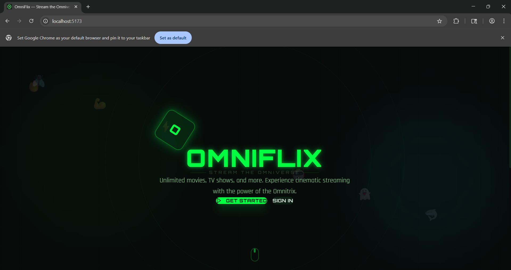
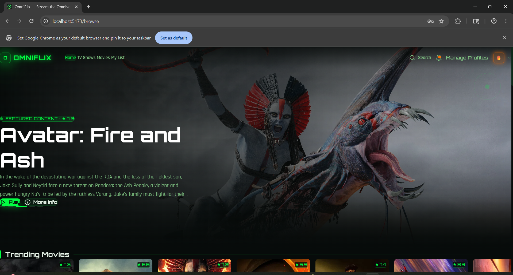
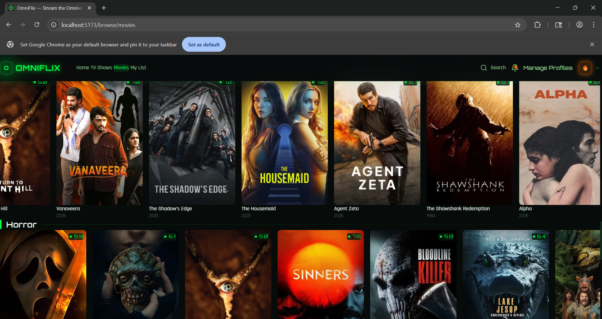
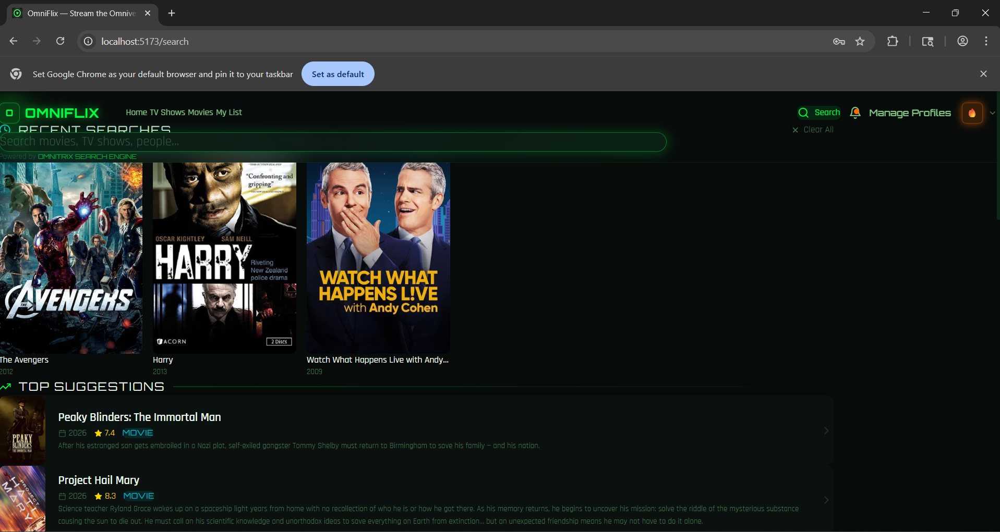
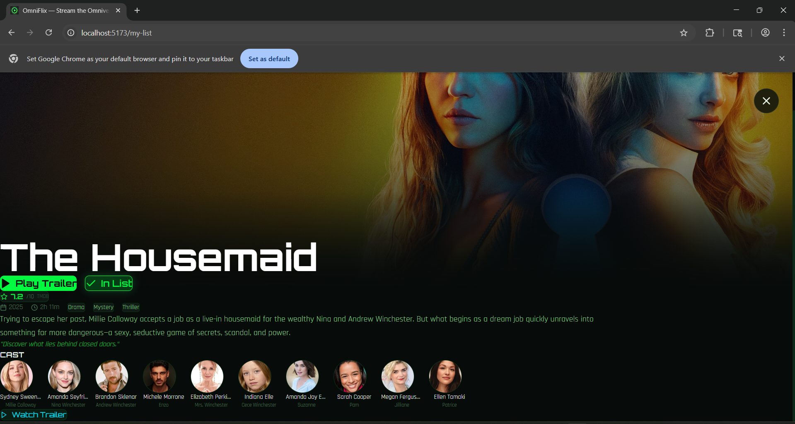
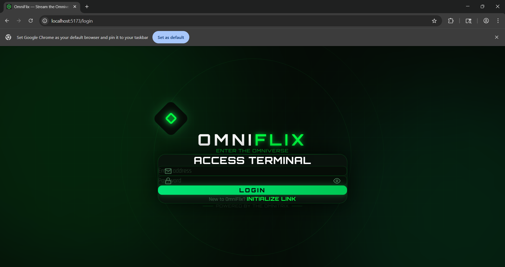
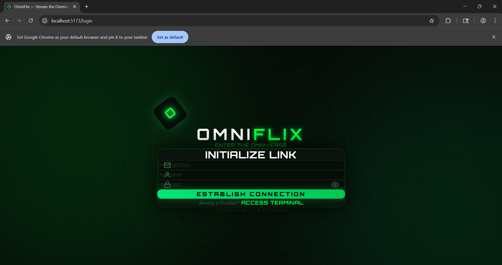
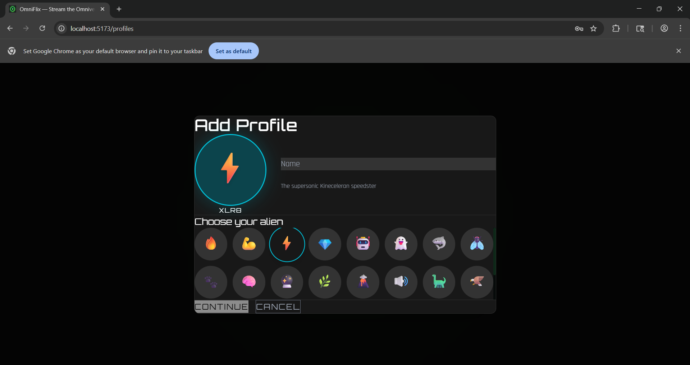
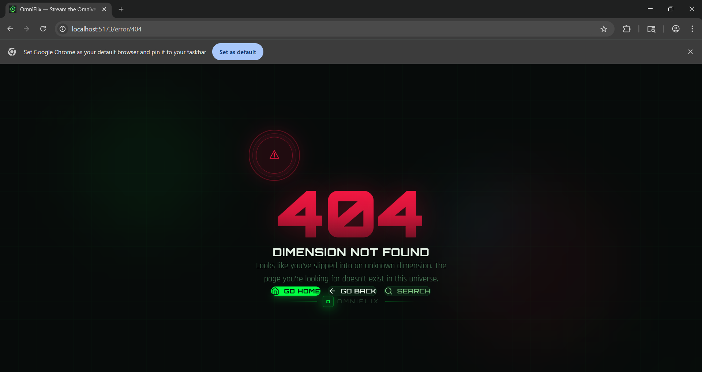

<p align="center">
  
</p>

<h1 align="center">OmniFlix — Stream the Omniverse</h1>

<p align="center">
  A full-stack, Netflix-style streaming platform fused with the <strong>Ben 10 Omnitrix</strong> aesthetic.<br/>
  Powered by TMDB, built with React 19 + Node.js, and themed for the Omniverse.
</p>

<p align="center">
  
  
  
  
  
  
</p>

---

## Features

| | Feature | Description |
|---|---|---|
| (1) | **Cinematic Hero Banner** | Auto-rotating, full-bleed hero with Play & More Info actions |
| (2) | **Alien Profile System** | Up to 5 profiles with unique Ben 10 alien avatars & isolated watchlists |
| (3) | **Categorized Browse Hub** | Anime, Cartoons, Marvel, DC, Harry Potter, Bollywood, Hollywood — region-aware |
| (4) | **Omnitrix Search Engine** | Multi-category search with recent history & top suggestions |
| (5) | **Movie / Show Detail Pages** | Full cast, trailer embed, genre tags, rating, watchlist toggle |
| (6) | **Themed Error Pages** | Custom 404 / 500 pages in the Omnitrix red-alert aesthetic |
| (7) | **In-Memory Caching** | `node-cache` middleware — zero-config, lightning-fast API responses |
| (8) | **JWT Auth** | Access & refresh token rotation with secure middleware |
| (9) | **Standardized API** | Unified `ApiResponse` format across all backend endpoints |
| (10) | **Admin Dashboard** | User management and content moderation panel |

---

## Screenshots

### Landing Page


### Browse — Hero Banner & Trending


### Movies Browse — Genre Rows


### Search — Omnitrix Engine


### Movie Detail — Cast & Trailer


### Auth — Login & Register
| Login | Register |
|:---:|:---:|
|  |  |

### Profile System — Alien Avatars


### Custom 404 Error Page


---

## Quick Start

### 1. Clone & Install
```bash
git clone https://github.com/your-username/omniflix.git
cd omniflix

cd server && npm install
cd ../client && npm install
```

### 2. Environment Setup

**`server/.env`**
```env
PORT=5000
MONGODB_URI=mongodb://localhost:27017/omniflix

JWT_ACCESS_SECRET=your_access_secret
JWT_REFRESH_SECRET=your_refresh_secret

TMDB_API_KEY=your_tmdb_api_key
```

**`client/.env`**
```env
VITE_API_URL=http://localhost:5000/api
```

> No Redis required. Caching is handled in-process via `node-cache`.

### 3. Run
```bash
# Terminal 1
cd server && npm run dev

# Terminal 2
cd client && npm run dev
```

Open **http://localhost:5173**

---

## Tech Stack

**Frontend**
- React 19, TypeScript, Vite
- Tailwind CSS v4, Framer Motion
- Zustand (state), React Router v7

**Backend**
- Node.js, Express, TypeScript
- MongoDB + Mongoose
- `node-cache` (caching), Zod (validation)
- JWT (auth), TMDB REST API

---

<p align="center">
  
</p>
